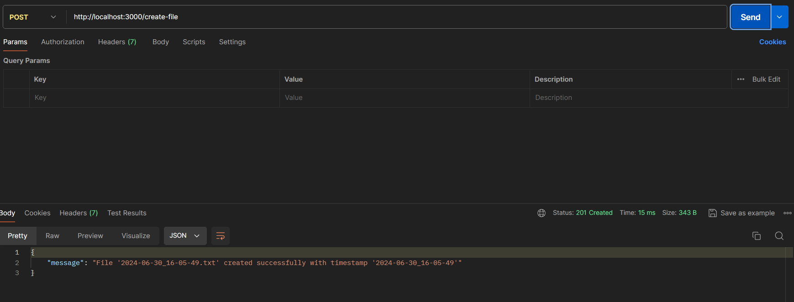
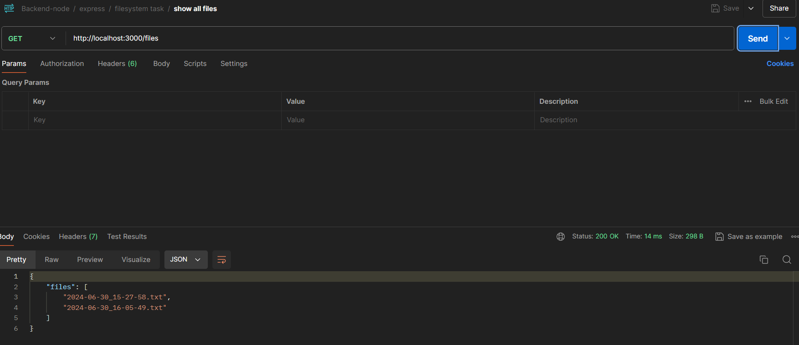

## NodeJs File System

**TASK DETAILS:**
 1. Write API endpoint which will create a text file in a particular folder

    * Content of the file should be the current timestamp.

    * The filename should be current date-time.txt

2. Write API endpoint to retrieve all the text files in that particular folder.

**Description**
   
   * In [Index.html](./index.html)
      
      - **Dependencies**: The script requires the Express.js framework, Node.js' `fs` (filesystem) and `path` modules, and a configuration file (`utils/config`) to get the port number.
      
      -  **Express Application Setup**: An instance of an Express application (`app`) is created.

      - **Middleware for JSON Parsing**: The server uses Express's built-in middleware to parse incoming JSON requests.

      - **Upload Folder Configuration**: The script sets up an `UPLOAD_FOLDER` constant, defining the directory path for storing uploaded files, using the `path` module.

      - **Ensure Folder Existence**: It checks if the `UPLOAD_FOLDER` exists, and if not, creates it recursively using `fs.mkdirSync`.

      - **Timestamp Function**: A utility function (`getCurrentDateTime`) formats the current date and time into a string suitable for filenames (e.g., `YYYY-MM-DD_HH-MM-SS`).

      - **File Creation Endpoint**: The `/create-file` POST endpoint creates a text file with the current timestamp as its content and filename. The server responds with a success message or an error if the file creation fails.

      - **File Retrieval Endpoint**: The `/files` GET endpoint reads the contents of the `UPLOAD_FOLDER`, filters for `.txt` files, and returns the list of these files in the response.

      - **Server Start**: The script starts the Express server on the port specified in the `config` file and logs a message to the console indicating the server is running and its URL.

      -  **Error Handling**: Both the `/create-file` and `/files` endpoints include basic error handling, returning HTTP status 500 with an error message if something goes wrong during file operations.
   
   * In [config.js](/utils/config.js) 
     
      - This script uses the `dotenv` package to load environment variables from a `.env` file. It extracts the `port` variable from the environment and exports it in an object. This allows the main server script to access the configured port number.

### Steps to setup the application:

   1. Create an empty directory
   2. Generate a package.json file by running `npm init -y` or `npm init`
   3. Install the required dependencies:
          - `npm install express`
   4. Create an entry point file (e.g. `index.js`) in the root directory
   5. In the index.js file:
          - Import express
          - Create an express app
          - Define a basic root route for the app inside index.js after creating the express app
      ```javascript
      app.get("/", (req, res) => {
        res.send("Hello World");
        });
      ```
         - listen for incoming http requests on a specific port
   6. Run the application by running `node index.js`

### Enable git version control

   1. Initialize a git repository by running `git init`
   2. Create a `.gitignore` file and add the following entries:
      ```
      node_modules/
      .env
      package-lock.json
      ```
   3. Rename the branch to `main` by running `git branch -M main`
   4. Add the changes to the staging area by running `git add .`
   5. Commit the changes by running `git commit -m "Initial commit"`
   6. Create a new repository on GitHub and copy the repository URL
   7. Add the remote repository in the vscode terminal by running `git remote add origin <repository-url>`
   8. Push the changes to the remote repository by running `git push -u origin main`

### Create a README.md file

   1. Create a README.md file in the root directory
   2. Add a description of the application

### Enable nodemon for automatic server restarts

   1. Install nodemon as a development dependency by running `npm install --save-dev nodemon`
   2. Add a start script in the package.json file
      ```json
      "scripts": {
        "start": "node index.js",
        "dev": "nodemon index.js"
      }
      ```
   3. To config the file in `.env` by running `npm install dovenv`
   4. Run the application in development mode by running `npm run dev`

**Output:**

 

    

**future enhancements:**
    
    Future enhancements could include adding user authentication, file upload validation, improved error handling, automated tests, pagination for the file list, support for different file types, a web-based interface for file management, and integration with a database.


---

### Render URL with Endpoints Details
Base URL: `http://localhost:3000`

**Endpoints:**
1. **Create File**: `POST /create-file`
   - Description: Creates a text file with the current timestamp as content.
   - Response: 
     ```json
     {
       "message": "File 'YYYY-MM-DD_HH-MM-SS.txt' created successfully with timestamp 'YYYY-MM-DD_HH-MM-SS'"
     }
     ```

2. **Retrieve Files**: `GET /files`
   - Description: Retrieves a list of all text files in the upload folder.
   - Response:
     ```json
     {
       "files": ["YYYY-MM-DD_HH-MM-SS.txt", "YYYY-MM-DD_HH-MM-SS.txt"]
     }
     ```
**Last Committed Hash ID**

      `fda02b7a346c85c2ab5a543dba3e43d319a77159`

**In postman**
   
   1. For creating the file use the endpoint:
   
        $post:  https://nodejs-filesystem-erbw.onrender.com/create-file

   2. To view all the files use the endpoint:

        $Get:   https://nodejs-filesystem-erbw.onrender.com/files

---